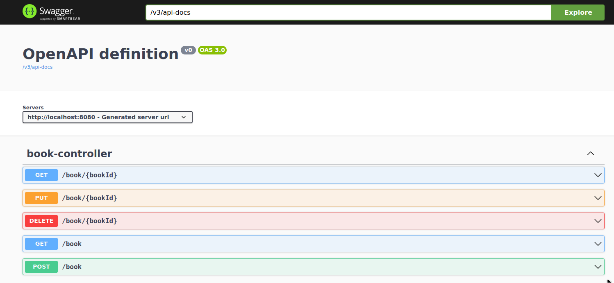

# Backend SpringBoot CRUD de Libros

## Arrancar MySQL en local
```
cd dev/
docker-compose up -d
```

## API
  


##  Actualización 19/12/2023
  Upgrade SpringBoot from 2.3.4 to 3.1.5

  Nueva clase BookService implementa interficie IBookService (SOLID Polimorfismo)

  Generada documentación con openapi.
  [API](http://localhost:8080/v3/api-docs)
  [Swagger](http://localhost:8080/swagger-ui/index.html#/)

##  Actualización 30/12/2023
  Añadido Spring Security: user/password con BCryptPassword

  Librería lombok.

  BookEntity: Numero de Páginas

## TODO
  Unit Testing
